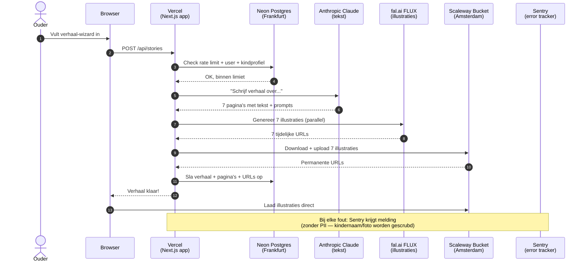
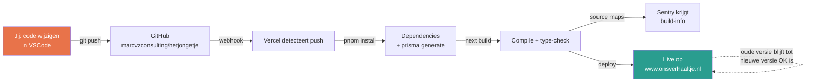
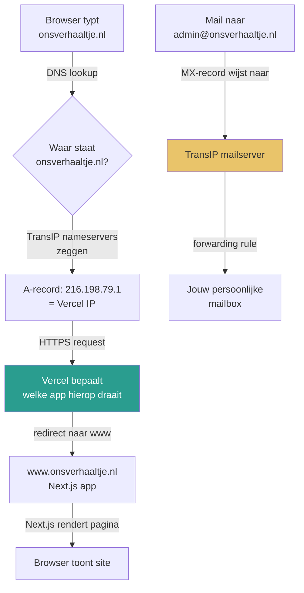
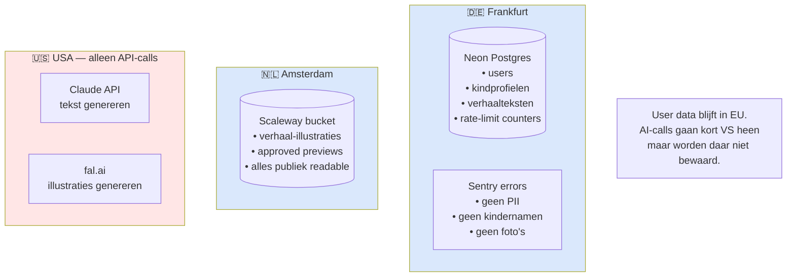

# Ons Verhaaltje — Architectuur Overzicht

Laatst bijgewerkt: 2026-04-17

Dit document legt uit welke diensten we gebruiken, waarvoor, en hoe alles samenwerkt. Bedoeld voor als je door de bomen het bos niet meer ziet.

---

## 🔐 Accounts & diensten op een rij

| Dienst | URL | Waarvoor | Kosten nu | Account via |
|---|---|---|---|---|
| **GitHub** | github.com/marcvzconsulting/hetjongetje | Broncode bewaren, triggert auto-deploys | Gratis | `marcvzconsulting` |
| **TransIP** | transip.nl | Domeinnaam `onsverhaaltje.nl` + mail-forwarding | ~€5/jr domein | Persoonlijk |
| **Vercel** | vercel.com | Host de Next.js app, domein-koppeling, SSL | Gratis (Hobby) | GitHub login |
| **Neon** | neon.tech | Productie PostgreSQL database (Frankfurt) | Gratis tier | GitHub login |
| **Scaleway** | console.scaleway.com | Image storage voor illustraties (Amsterdam) | <€1/mnd verwacht | `admin@onsverhaaltje.nl` |
| **Sentry** | de.sentry.io | Error tracking + monitoring (Frankfurt) | Gratis tier | `admin@onsverhaaltje.nl` |
| **Anthropic** | console.anthropic.com | Claude AI: verhalen schrijven + foto-beschrijvingen | Pay-per-use (~€0.05/verhaal) | Persoonlijk |
| **fal.ai** | fal.ai | FLUX AI voor illustraties | Pay-per-use (~€0.10/verhaal) | Persoonlijk |
| **Docker Desktop** | (lokaal) | Dev PostgreSQL op je laptop (port 5433) | Gratis | n.v.t. |

---

## 🌐 Wat gebeurt er als een gebruiker een verhaal maakt



**Waarom deze verdeling?**
- **Vercel** doet de orchestratie: één plek die alles coördineert
- **Neon** houdt alle "koude" data (users, verhalen, profielen) op één plek
- **Scaleway** serveert de "hete" data (illustraties) direct naar de browser, zonder Vercel te belasten
- **Claude + fal.ai** zijn specialistische AI-services — wij huren hun rekenkracht in per verhaal
- **Sentry** staat ernaast om fouten op te vangen zonder de flow te verstoren

---

## 🚢 Wat gebeurt er als je nieuwe code pusht



**Tijd van push tot live:** ~3-5 minuten, zonder downtime.
**Als build faalt:** Vercel behoudt de oude versie — bezoekers merken niets.

---

## 🌍 Hoe `onsverhaaltje.nl` werkt



**Waarom dit gescheiden is:**
- Website-verkeer (`A` + `CNAME`) → Vercel
- Email-verkeer (`MX` + `TXT`/SPF + DKIM) → TransIP
- Bij TransIP staan ze beide ingesteld, zonder elkaar in de weg te zitten

---

## 📦 Waar staat welke data?



**Privacy overweging:** Claude en fal.ai zijn VS-gebaseerd, maar ze bewaren jouw data niet (API-calls zijn "transient"). In de privacy policy straks vermelden we dit expliciet voor GDPR.

---

## 💸 Hoeveel kost het nu

| Dienst | Kosten | Wanneer wordt het duurder? |
|---|---|---|
| GitHub private repo | €0 | Nooit voor solo |
| TransIP domein | ~€5/jaar | Verlenging |
| Vercel Hobby | €0 | Bij ~100GB bandwidth/maand |
| Neon gratis tier | €0 | Boven 0.5 GB storage of 100 compute-uren/mnd |
| Scaleway | €0 | Boven 75 GB egress/mnd (nu: paar GB) |
| Sentry gratis | €0 | Boven 5.000 errors/maand |
| Anthropic Claude | ~€0.05/verhaal | Schaalt met gebruik |
| fal.ai | ~€0.10/verhaal | Schaalt met gebruik |

**Ruwe schatting: eerste 100 testers = maximaal ~€15-20 aan AI-kosten, verder alles gratis.**

---

## 🔑 Waar staan welke credentials?

| Credential | Locatie | Gebruikt door |
|---|---|---|
| `DATABASE_URL` (dev) | `.env` (lokaal) | `pnpm dev` |
| `DATABASE_URL` (prod) | `.env.production.local` + Vercel env vars | Scripts tegen Neon, Vercel deploy |
| `AUTH_SECRET` | `.env` (dev) + Vercel (prod, andere waarde!) | NextAuth |
| `AUTH_URL` | Vercel env vars | NextAuth (prod) |
| `ANTHROPIC_API_KEY` | `.env` + Vercel | Story generator |
| `FAL_KEY` | `.env` + Vercel | Illustration generator |
| `SCALEWAY_*` | `.env` + Vercel | Image uploader |
| `SENTRY_*` | `.env` + Vercel | Error tracker |

**Gitignored** (nooit in git): `.env`, `.env.production.local`, `.env.*.local`

---

## 🚨 Wat te doen als er iets stuk gaat

| Symptoom | Eerst kijken bij | Volgende stap |
|---|---|---|
| Site is helemaal offline | Vercel dashboard → Deployments | Rollback naar vorige deploy |
| Login werkt niet meer | Sentry → Issues | Check `AUTH_URL` + `AUTH_SECRET` |
| Illustraties laden niet | Scaleway dashboard → Objects | Check of bucket nog public-read is |
| Verhaal genereren faalt | Sentry → Issues + Vercel logs | Check credits bij Anthropic en fal.ai |
| Per ongeluk data verwijderd | Neon → Restore | Point-in-time restore tot 6u terug |
| Email komt niet meer binnen | TransIP → DNS | Check dat MX-records nog op TransIP staan |

---

## 🧭 Stappen-voor-stappen voor veelvoorkomende taken

### Code wijzigen en live zetten
```bash
# In je project folder:
git add .
git commit -m "Beschrijving van wijziging"
git push origin master
# Vercel deployt automatisch ~3-5 min later
```

### Dev-server starten
```bash
# Eerst: Docker Desktop starten (voor lokale DB)
pnpm dev
# Open http://localhost:3000
```

### Productie-DB inspecteren
```bash
# Schema updaten:
pnpm db:push:prod

# Users checken:
npx tsx scripts/check-prod-user.ts <email>
```

### Lokaal test-bestand op Scaleway
```bash
npx tsx scripts/test-scaleway.ts
```

---

## 🎯 Mentale model

Denk aan Ons Verhaaltje als een orkest:

- **Vercel** is de dirigent — coördineert alles
- **Neon** is de bibliotheek — bewaart de bladmuziek (data)
- **Scaleway** is de galerie — toont de schilderijen (illustraties)
- **Claude + fal.ai** zijn de externe gastmusici — we huren hun skill per keer
- **Sentry** is de geluidscheck-technicus — meldt als iemand vals speelt
- **GitHub** is het archief — elke versie van de partituur wordt bewaard
- **TransIP** is de stadscanon — wijst iedereen de weg naar het concertgebouw

Als één muzikant uitvalt, kun je die vervangen zonder het hele concert af te blazen — dat is het voordeel van modulaire architectuur.
