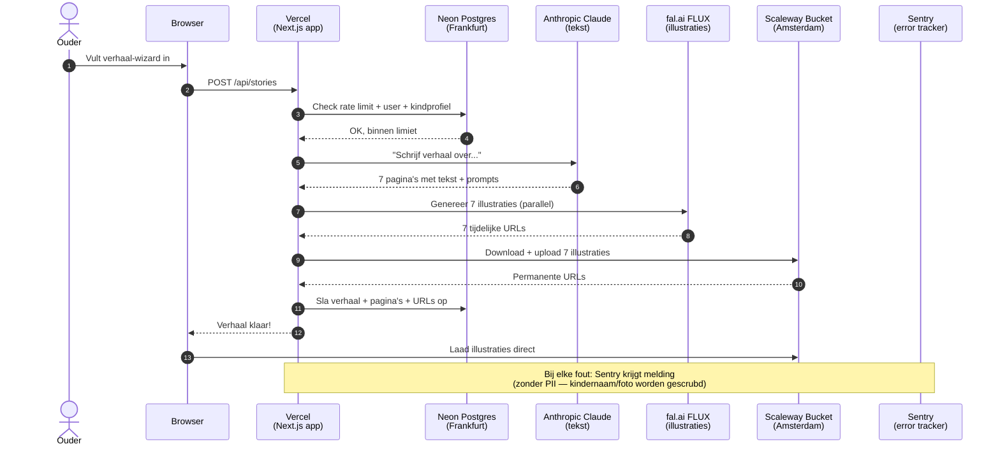
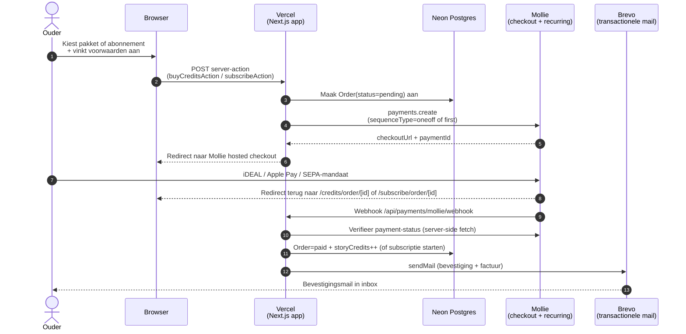
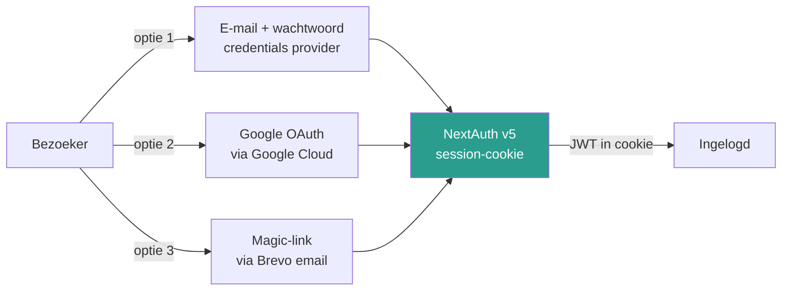
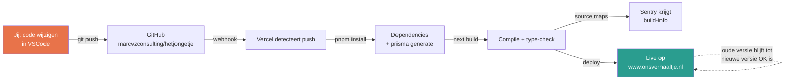
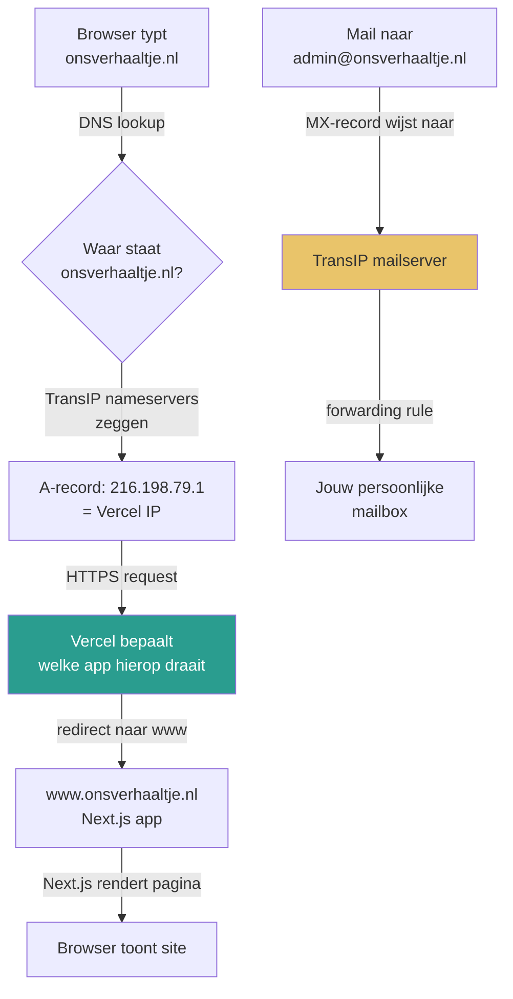
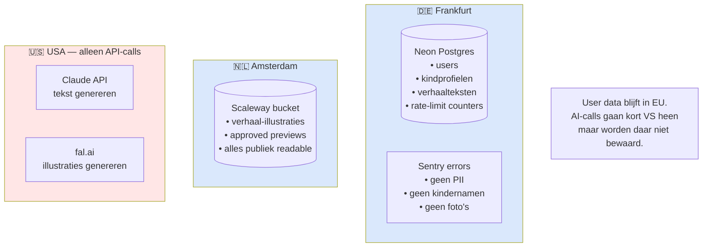

# Ons Verhaaltje — Architectuur Overzicht

Laatst bijgewerkt: 2026-05-01 (v3: betalingen + abonnementen via Mollie, Brevo email, Google OAuth, magic-link)

Dit document legt uit welke diensten we gebruiken, waarvoor, en hoe alles samenwerkt. Bedoeld voor als je door de bomen het bos niet meer ziet.

---

## 🔐 Accounts & diensten op een rij

| Dienst | URL | Waarvoor | Kosten nu | Account via |
|---|---|---|---|---|
| **GitHub** | github.com/marcvzconsulting/hetjongetje | Broncode bewaren, triggert auto-deploys | Gratis | `marcvzconsulting` |
| **TransIP** | transip.nl | Domeinnaam `onsverhaaltje.nl` + mail-forwarding | ~€5/jr domein | Persoonlijk |
| **Vercel** | vercel.com | Host de Next.js app, domein-koppeling, SSL | Gratis (Hobby) | GitHub login |
| **Vercel Analytics** | vercel.com → project → Analytics | Pageviews, bezoekers, referrers — privacy-first | Gratis tot 2.500 events/mnd | (onderdeel Vercel) |
| **Vercel Speed Insights** | vercel.com → project → Speed Insights | Core Web Vitals bij echte bezoekers | Gratis tot 10.000 samples/mnd | (onderdeel Vercel) |
| **Neon** | neon.tech | Productie PostgreSQL database (Frankfurt) | Gratis tier | GitHub login |
| **Scaleway** | console.scaleway.com | Image storage voor illustraties (Amsterdam) | <€1/mnd verwacht | `admin@onsverhaaltje.nl` |
| **Sentry** | de.sentry.io | Error tracking + monitoring (Frankfurt) | Gratis tier | `admin@onsverhaaltje.nl` |
| **Anthropic** | console.anthropic.com | Claude AI: verhalen schrijven + foto-beschrijvingen | Pay-per-use (~€0.05/verhaal) | Persoonlijk |
| **fal.ai** | fal.ai | FLUX AI voor illustraties | Pay-per-use (~€0.10/verhaal) | Persoonlijk |
| **Mollie** | my.mollie.com | Betaalprovider — credits, abonnementen, SEPA-incasso | 1.8% + €0.25 per transactie (iDEAL ~€0.29) | `admin@onsverhaaltje.nl` |
| **Brevo** | app.brevo.com | Transactionele e-mail + nieuwsbrief-contacten | Gratis tot 300 mails/dag | `admin@onsverhaaltje.nl` |
| **Google Cloud** | console.cloud.google.com | OAuth-client voor "Inloggen met Google" | Gratis | `admin@onsverhaaltje.nl` |
| **Docker Desktop** | (lokaal) | Dev PostgreSQL op je laptop (port 5433) | Gratis | n.v.t. |

---

## 🌐 Wat gebeurt er als een gebruiker een verhaal maakt



**Waarom deze verdeling?**
- **Vercel** doet de orchestratie: één plek die alles coördineert
- **Neon** houdt alle "koude" data (users, verhalen, profielen) op één plek
- **Scaleway** serveert de "hete" data (illustraties) direct naar de browser, zonder Vercel te belasten
- **Claude + fal.ai** zijn specialistische AI-services — wij huren hun rekenkracht in per verhaal
- **Sentry** staat ernaast om fouten op te vangen zonder de flow te verstoren

---

## 💳 Wat gebeurt er bij een betaling

Twee soorten betalingen: **eenmalige credit-pakketten** en **abonnementen** (recurring).



**Belangrijke eigenschappen:**
- **Webhook is bron van waarheid**, niet de redirect — webhook is idempotent en wordt mogelijk meerdere keren afgevuurd
- **Abonnement = 2 fases**: eerste betaling (`sequenceType=first`) zet een SEPA-mandaat; daarna maakt de webhook een Mollie-subscription voor recurring billing
- **Snapshot-semantiek**: `Order` slaat `priceCents` + `vatRate` op moment-van-koop op, dus prijswijzigingen in `/admin/pricing` schrijven historie niet over
- **iDEAL voor abonnementen** vereist actieve **SEPA Direct Debit** in Mollie-profiel — anders filtert Mollie iDEAL eruit en zie je alleen creditcard

Belangrijke files:
- [src/lib/payments/mollie.ts](../src/lib/payments/mollie.ts) — Mollie-client + helpers
- [src/lib/payments/orders.ts](../src/lib/payments/orders.ts) — credit-orders, webhook-dispatch
- [src/lib/payments/subscriptions.ts](../src/lib/payments/subscriptions.ts) — recurring billing logica
- [src/app/api/payments/mollie/webhook/route.ts](../src/app/api/payments/mollie/webhook/route.ts) — webhook-endpoint
- [src/app/(app)/credits/](../src/app/(app)/credits/) — koop-flow voor pakketten
- [src/app/(app)/subscribe/](../src/app/(app)/subscribe/) — abonnementen
- [src/app/(admin)/admin/pricing/](../src/app/(admin)/admin/pricing/) — prijsbeheer

**Mollie checkout-branding** ([profile in dashboard](https://my.mollie.com/dashboard/)):
- Logo: `/checkout-logo.png` (paper-tinte achtergrond, "ons verhaaltje" wordmark)
- Wallpaper: `/checkout-wallpaper.png` (paper-kleur `#f5efe4` met goud-stipjes)
- Knop-kleur: `#c9a961` (gold-token)

---

## 📧 Email — wie stuurt wat

```mermaid
flowchart LR
    App[Next.js app]
    App -->|sendMail| Brevo[Brevo<br/>transactionele API]
    App -->|subscribeToNewsletter / deleteContact| BrevoList[Brevo<br/>contact-lijst]
    Brevo -->|SMTP| Inbox[Gebruiker]
    BrevoList -.->|nieuwsbrief campagnes| Inbox

    TransIP[TransIP<br/>mail-forwarding] -->|admin@onsverhaaltje.nl| PrivEmail[Persoonlijke inbox]

    style App fill:#2a9d8f,color:#fff
    style Brevo fill:#e9c46a
    style TransIP fill:#dae8fc
```

**Twee verschillende email-paden, niet door elkaar halen:**
- **Inkomend** (`info@`, `admin@onsverhaaltje.nl`) → TransIP forwarding → persoonlijke inbox
- **Uitgaand** (verhaal klaar, betaling, magic-link, wachtwoord-reset, nieuwsbrief) → Brevo

Templates staan in [src/lib/email/templates/](../src/lib/email/templates/):
- `magic-link.ts`, `password-changed.ts`, `password-reset.ts`
- `story-ready.ts`, `account-approved.ts`
- `credits-purchased.ts`, `subscription-started.ts`
- `newsletter-welcome.ts`, `book-order-confirmation.ts`

Alle templates gebruiken [src/lib/email/editorial-template.ts](../src/lib/email/editorial-template.ts) als gemeenschappelijke wrapper voor consistente styling.

---

## 🔐 Authenticatie — drie manieren om in te loggen



**Belangrijke regels:**
- **Admins** kunnen niet met wachtwoord inloggen — alleen via magic-link of Google. Beschermt tegen credential-stuffing.
- **Magic-link** is rate-limited per IP en per email, gebruikt single-use tokens met 15-min TTL
- **Google OAuth** maakt een pending-account aan voor nieuwe users (zelfde flow als handmatige registratie)
- **callbackUrl** wordt gehonoreerd door /login na succesvolle credentials- of Google-login (alleen relatieve paden, anti-open-redirect)

Code: [src/lib/auth/](../src/lib/auth/), [src/app/(auth)/](../src/app/(auth)/), [src/lib/magic-link.ts](../src/lib/magic-link.ts)

---

## 🚢 Wat gebeurt er als je nieuwe code pusht



**Tijd van push tot live:** ~3-5 minuten, zonder downtime.
**Als build faalt:** Vercel behoudt de oude versie — bezoekers merken niets.

---

## 🌍 Hoe `onsverhaaltje.nl` werkt



**Waarom dit gescheiden is:**
- Website-verkeer (`A` + `CNAME`) → Vercel
- Email-verkeer (`MX` + `TXT`/SPF + DKIM) → TransIP
- Bij TransIP staan ze beide ingesteld, zonder elkaar in de weg te zitten

---

## 📦 Waar staat welke data?



**Privacy overweging:** Claude en fal.ai zijn VS-gebaseerd, maar ze bewaren jouw data niet (API-calls zijn "transient"). In de privacy policy straks vermelden we dit expliciet voor GDPR.

---

## 💸 Hoeveel kost het nu

| Dienst | Kosten | Wanneer wordt het duurder? |
|---|---|---|
| GitHub private repo | €0 | Nooit voor solo |
| TransIP domein | ~€5/jaar | Verlenging |
| Vercel Hobby | €0 | Bij ~100GB bandwidth/maand |
| Neon gratis tier | €0 | Boven 0.5 GB storage of 100 compute-uren/mnd |
| Scaleway | €0 | Boven 75 GB egress/mnd (nu: paar GB) |
| Sentry gratis | €0 | Boven 5.000 errors/maand |
| Anthropic Claude | ~€0.05/verhaal | Schaalt met gebruik |
| fal.ai | ~€0.10/verhaal | Schaalt met gebruik |
| Mollie | 1.8% + €0.25 per transactie (iDEAL ~€0.29) | Per transactie, geen vaste kosten |
| Brevo | €0 | Boven 300 mails/dag (~9.000/mnd gratis) |
| Google OAuth | €0 | Niet kostend voor consumer-apps |

**Ruwe schatting: eerste 100 testers = maximaal ~€15-20 aan AI-kosten, verder alles gratis.**

---

## 🔑 Waar staan welke credentials?

| Credential | Locatie | Gebruikt door |
|---|---|---|
| `DATABASE_URL` (dev) | `.env` (lokaal) | `pnpm dev` |
| `DATABASE_URL` (prod) | `.env.production.local` + Vercel env vars | Scripts tegen Neon, Vercel deploy |
| `AUTH_SECRET` | `.env` (dev) + Vercel (prod, andere waarde!) | NextAuth |
| `AUTH_URL` | Vercel env vars | NextAuth (prod) |
| `ANTHROPIC_API_KEY` | `.env` + Vercel | Story generator |
| `FAL_KEY` | `.env` + Vercel | Illustration generator |
| `SCALEWAY_*` | `.env` + Vercel | Image uploader |
| `SENTRY_*` | `.env` + Vercel | Error tracker |
| `MOLLIE_API_KEY` | `.env` (test_…) + Vercel (test_… nu, live_… straks) | Betalingen, abonnementen |
| `BREVO_API_KEY` | `.env` + Vercel | Transactionele e-mail + nieuwsbrief-contacten |
| `GOOGLE_CLIENT_ID` / `GOOGLE_CLIENT_SECRET` | `.env` + Vercel | Google OAuth login |

**Gitignored** (nooit in git): `.env`, `.env.production.local`, `.env.*.local`

---

## 📊 Monitoring — wat zie je waar

Vier verschillende bronnen voor vier verschillende vragen:

```mermaid
flowchart LR
    App[www.onsverhaaltje.nl]

    App -->|stuurt errors naar| Sentry[Sentry<br/>Issues]
    App -->|anonieme pageviews| VA[Vercel<br/>Analytics]
    App -->|performance samples| VSI[Vercel<br/>Speed Insights]
    App -->|bezoeker-logs| VLogs[Vercel<br/>Logs]

    Sentry -->|email bij nieuwe issue| Inbox[admin@<br/>onsverhaaltje.nl]

    style App fill:#2a9d8f,color:#fff
    style Inbox fill:#e9c46a
```

| Vraag | Waar kijk je? | Update frequentie |
|---|---|---|
| "Werkt de site?" | Vercel → Deployments (groen/rood) | Real-time |
| "Crasht er iets?" | Sentry → Issues (+ email alert) | Real-time + email |
| "Hoeveel bezoekers heb ik?" | Vercel → Analytics | ~15 min delay |
| "Is de site snel genoeg?" | Vercel → Speed Insights | ~15 min delay |
| "Wie heeft iets stuks gedaan?" | Vercel → Runtime Logs | Real-time |
| "Hoeveel AI credits nog over?" | Anthropic + fal.ai dashboards | Real-time |

**Privacy-kenmerken van onze monitoring:**
- Vercel Analytics gebruikt **geen cookies** — GDPR-vrij zonder cookie banner
- Sentry scrubt automatisch kindernamen, foto's, verhaalteksten vóór verzenden
- Speed Insights aggregeert alleen, geen individuele user tracking

## 🚨 Wat te doen als er iets stuk gaat

| Symptoom | Eerst kijken bij | Volgende stap |
|---|---|---|
| Site is helemaal offline | Vercel dashboard → Deployments | Rollback naar vorige deploy |
| Login werkt niet meer | Sentry → Issues | Check `AUTH_URL` + `AUTH_SECRET` |
| Illustraties laden niet | Scaleway dashboard → Objects | Check of bucket nog public-read is |
| Verhaal genereren faalt | Sentry → Issues + Vercel logs | Check credits bij Anthropic en fal.ai |
| Per ongeluk data verwijderd | Neon → Restore | Point-in-time restore tot 6u terug |
| Email komt niet meer binnen | TransIP → DNS | Check dat MX-records nog op TransIP staan |
| Site voelt traag aan | Vercel → Speed Insights | Zoek pagina's met hoge LCP/INP |
| Minder bezoekers dan verwacht | Vercel → Analytics → Referrers | Check of social-link nog klopt |
| Tester zegt "er ging iets mis" maar Sentry is leeg | Vercel → Runtime Logs | Zoek op de tijd van de melding |
| Betaling lukt niet / klant ziet alleen creditcard bij abonnement | Mollie dashboard → Profielen → Betaalmethodes | SEPA Direct Debit moet actief zijn voor iDEAL bij recurring |
| Webhook van Mollie komt niet aan | Mollie → Activity → webhook-log | Check `/api/payments/mollie/webhook` is publiek bereikbaar (geen auth-gate) |
| Mail komt niet aan | Brevo → Statistics → Transactional | Check daily-quota (300 gratis); klant in spam laten kijken |
| Magic-link mailtje blijft uit | Vercel logs `[magic-link]` + Brevo logs | Anti-enumeration: ook bij onbekend e-mailadres lijkt het te slagen |

---

## 🧭 Stappen-voor-stappen voor veelvoorkomende taken

### Code wijzigen en live zetten
```bash
# In je project folder:
git add .
git commit -m "Beschrijving van wijziging"
git push origin master
# Vercel deployt automatisch ~3-5 min later
```

### Dev-server starten
```bash
# Eerst: Docker Desktop starten (voor lokale DB)
pnpm dev
# Open http://localhost:3000
```

### Productie-DB inspecteren
```bash
# Schema updaten:
pnpm db:push:prod

# Users checken:
npx tsx scripts/check-prod-user.ts <email>
```

### Lokaal test-bestand op Scaleway
```bash
npx tsx scripts/test-scaleway.ts
```

---

## 🎯 Mentale model

Denk aan Ons Verhaaltje als een orkest:

- **Vercel** is de dirigent — coördineert alles
- **Neon** is de bibliotheek — bewaart de bladmuziek (data)
- **Scaleway** is de galerie — toont de schilderijen (illustraties)
- **Claude + fal.ai** zijn de externe gastmusici — we huren hun skill per keer
- **Mollie** is de kassa bij de ingang — int de toegangsprijs en houdt abonnementen bij
- **Brevo** is de postbode — bezorgt elke bevestiging, magic-link en bevestigingsmail
- **Sentry** is de geluidscheck-technicus — meldt als iemand vals speelt
- **GitHub** is het archief — elke versie van de partituur wordt bewaard
- **TransIP** is de stadscanon — wijst iedereen de weg naar het concertgebouw

Als één muzikant uitvalt, kun je die vervangen zonder het hele concert af te blazen — dat is het voordeel van modulaire architectuur.
